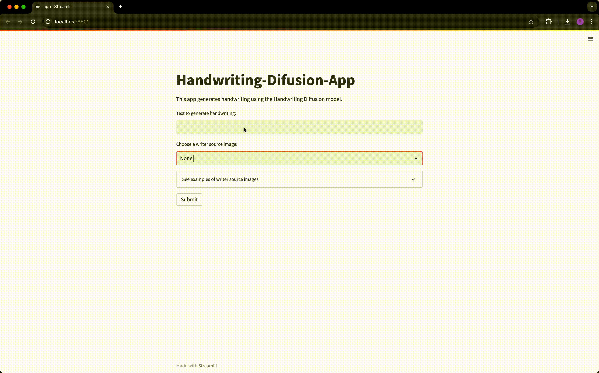

<div align="center">

# Handwriting-Difusion-App

</div>
An application that generates handwritten text using Diffusion Models.

## DEMO


by streamlit

## Overview
This application leverages TensorFlow and Streamlit to generate realistic handwritten text from user input.

## Features
- Generate handwritten text in real-time
- Customizable handwriting styles
- Easy-to-use interface

## Requirement

* Python 3.7
* TensorFlow 2.3.0
* Streamlit

See [requirements.txt](./requirements.txt) for more information.

To install the required packages for your local environment, run:
```sh
pip install -r requirements.txt
```

## Installation


1. **Clone the repository**

    ```sh
    $ git clone https://github.com/t-na10/handwriting-generation.git
    $ cd handwriting-generation
    ```

2. **Set up Docker environment**

    ```sh
    $ docker compose up -d hwd-local
    ```

    ```sh
    $ docker exec -it hwd-local bash
    ```
## Usage

To run the demo, use the following command within the Docker container or your local environment:

```sh
$ streamlit run app.py --server.port 8080
```

Then, open your browser and navigate to `http://localhost:8080`.